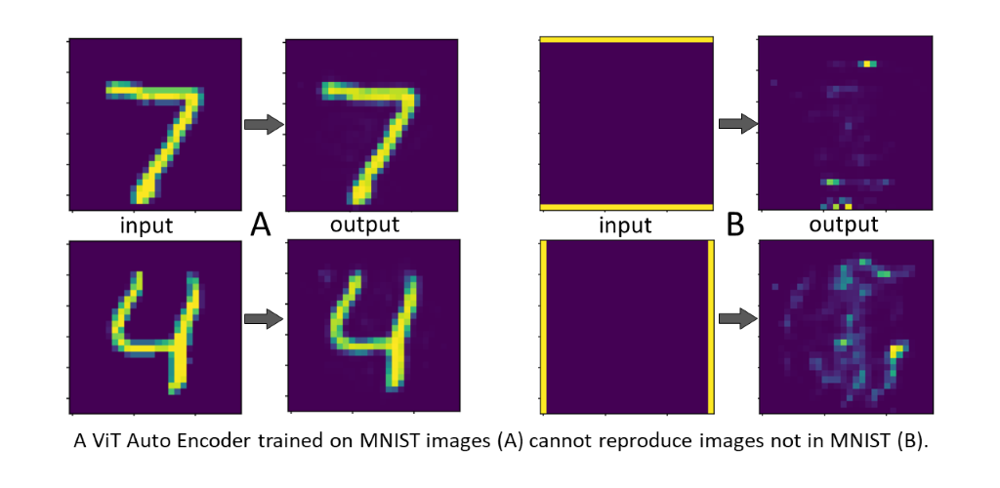

# Out Of Distribution responses of a Vision Transformer (ViT) configured as an Auto Encoder and trained on MNIST

Several recent papers use generative AI (gAI) to predict cellular responses to previously unseen perturbations. First principles arguments (refs. 1, 2) suggest only mechanistically causal models can respond to OOD inputs correctly. Current gAI models learn patterns, not mechanisms (except for modulo algebra, where the pattern in the data is also the algorithm). So, can they really predict OOD?

For a reality-check, I configured a Vision Transformer (a GPT-like deep-learning neural network) as an Auto Encoder and trained it on the MNIST hand-written digits. As shown below, the network reproduces MNIST digits well, but "hallucinates" when presented with OOD inputs. The same seems true for online large-scale AI tools: if you give them an input not like anything in their training data, they hallucinate. 

## Citations

[1] Bertrand Russell, “The problems of philosophy”, Chapter 6. 
Home University Library 1912. 
Available online at: http://www.ditext.com/russell/russell.html 

> Quote: “The man who has fed the chicken every day throughout its life at last wrings its neck instead”, 

[2] Hamid Bolouri,
“Computational Modeling of Gene Regulatory Networks – a primer”, 
Chapter 3. Imperial College Press, London, 2008.
Avaiable online at: https://zenodo.org/records/10445905

> Quote: "[A model] cannot predict correctly outside the range of conditions it was built on."
